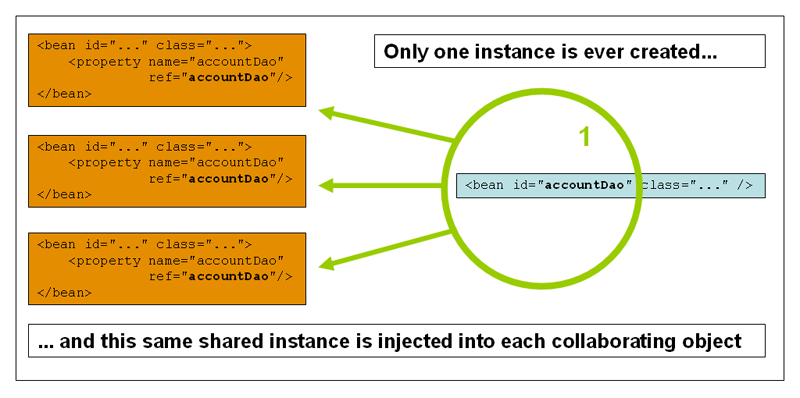

# Bean 생성 주기

## 목차
1. [스프링 컨테이너](##스프링-컨테이너)
   - [스프링 컨테이너 생성](###스프링-컨테이너-생성)
   - [스프링 빈 등록, 의존 관계 설정](###스프링-빈-등록,-의존 관계-설정)
   - [스프링 빈 이름 조회](###스프링-빈-이름-조회)
   - [singleton test](##singleton-test)
2. [Bean Scope 학습 ](##Bean-Scope-학습)
   - [singleton Scope](###singleton-Scope)
   - [prototype Scope](###prototype-Scope)
   - [request Scope](###request-Scope)
   - [session Scope](###session-Scope)
   - [application Scope](###application-Scope)
   - [webSocket Scope](###webSocket-Scope)


## 스프링 컨테이너
> 스프링 컨테이너를 부를 때 `BeanFactory` `ApplicationContext`로 구분해서 이야기 한다. 일반적으로 `ApplicationContext`를 스프링 컨테이너라 한다.

### 스프링 컨테이너 생성
아래코드는 HelloConfig.class를 구성정보로 지정했다.
> ex) ApplicationContext applicationContext = new AnnotationConfigApplicationContext(HelloConfig.class)

### 스프링 빈 등록, 의존 관계 설정
@Configuration이 붙은 클래스를 Bean으로 등록하고 해당 클래스를 파싱하고 Bean이 붙어 있는 메소드를 찾아서 생성한다. @Configuration이 안 붙은 클래스에서 @Bean을 이용할 경우 singleton을 보장하지 않는다.

``` java
@Configuration
public class HelloConfig {

    @Bean
    public MemberRepository memberRepository() {
        return new MemberRepositoryImp();
    }

    @Bean
    public MemberService memberService() {
        return new MemberServiceImp(memberRepository());
    }
```

### 스프링 빈 이름 조회
``` java 
    @Test
    @DisplayName("모든 빈 확인하기")
    public void allBeanCheck() throws Exception{
        
        //given
        AnnotationConfigApplicationContext config = new AnnotationConfigApplicationContext(HelloConfig.class);

        //when
        String[] beanDefinitionNames = config.getBeanDefinitionNames();

        //then
        Arrays.stream(beanDefinitionNames).forEach(System.out::println);
    }
```

### singleton test
``` java
   @Test
    @DisplayName("싱글톤 작동방식 확인")
    public void springContainer() throws Exception{

        //given
        AnnotationConfigApplicationContext config = new AnnotationConfigApplicationContext(HelloConfig.class);

        //when
        MemberService memberService1 = config.getBean("memberService", MemberService.class);
        MemberService memberService2 = config.getBean("memberService", MemberService.class);

        //then
        Assertions.assertThat(memberService1).isSameAs(memberService2);
    }
```


#### 빈 생성 주의 사항
> 빈 이름은 항상 다른 이름을 부여해야 한다. 만약 같은 이름을 부여할 경우 다른 빈이 무시되거나 기존 빈을 덮어버리거나 설정에 따라 오류가 발생할 수 있다.


### @Autowired
required = false로 설정할 경우 주입할 Bean이 없어도 오류가 발생하지 않는다.


### lite-Mode
Spring에서 lite mode는 @Configuration이 아닌 단순한 @Component로 사용될 수 있는 설정 클래스를 지원하는 기능입니다. Spring은 이러한 lite mode 설정 클래스에서 @Bean 메서드를 발견해도 이를 프록시 처리하거나 클래스 전역적으로 관리하지 않고, 대신 lite하게 처리하여 각 @Bean 메서드를 독립적인 방식으로 실행하고 관리합니다.

이를 통해 개발자는 lite mode에서 필요에 따라 간단하게 Bean을 정의하고 사용할 수 있으며, 특히 서로 독립적인 컴포넌트 설정이 필요할 때 활용할 수 있습니다. 다만, 이 경우 Bean들 간에 의존성이 있는 복잡한 구성보다는 개별 Bean을 독립적으로 정의할 때 더 적합합니다.
> proxyBeanMethods=false, or @Configuration 대신해서 @Component 사용

### proxyBeanMethods=false 을 사용하는 이유 추론
1. @Configuration 클래스에 cglib 런타임 코드 생성 기술을 적용해서 프록시 방식으로 감싸서 동작하기 때문에 생성 비용이 더 크다.
   하지만 실제로는 큰 차이가 없다.
2. @Bean 메소드가 여러번 호출할 때 매번 동일 오브젝트가 실행되는 것이 자바 코드를 봤을 때 기대하는 방식과 다르다.


### CGLIB(Code Generator Library)
> 코드 생성 라이브러리로서 런타임에 동적으로 자바 클래스의 프록시를 생성해주는 기능을 제공한다. 인터페이스가 아닌 클래스에 대해서 동적 프록시를 생성할 수 있다.


## Bean Scope 학습 
### singleton Scope
+ 싱글톤 빈의 공유 인스턴스는 하나만이 관리됩니다. 특정 Bean을 요청할 경우 Spring container에서 `하나의 특정 인스턴스`로 반환합니다.
>Bean Scope가 singleton으로 지정이 된다면 단 하나만의 인스턴스가 생성됩니다.이 단일 인스턴스는 캐쉬로 저장이 되고 후속 요청에서는 캐시된 객체를 반환합니다.



Spring에서의 `Singleton Bean`과 GoF 싱글톤 패턴은 개념적으로 다릅니다. 쉽게 말하면, 두 가지 방식의 차이는 `객체의 생성 범위`와 `생성 방법`에 있습니다.

#### GoF 싱글톤 패턴
+ 하나의 클래스에 대해 정확히 하나의 인스턴스만 생성되도록 강제합니다.
이 클래스의 인스턴스는 `전역적`으로 하나만 존재하며, 여러 번 호출되더라도 같은 인스턴스가 반환됩니다.
즉, `클래스 로더` 단위에서 하나의 인스턴스를 공유하는 방식입니다.


#### Spring의 싱글톤 빈
+ `Spring 컨테이너 `내에서 하나의 빈에 대해 하나의 인스턴스만 존재하도록 보장합니다. 즉, Spring 컨테이너를 기준으로 하나의 인스턴스만 생성됩니다.
빈을 정의할 때 Spring에서 관리하며, Spring 컨테이너가 빈의 라이프사이클을 관리합니다.


#### 결론
+ GoF 싱글톤은 클래스 레벨에서 하나의 인스턴스만 존재하도록 강제하는 패턴이고, Spring 싱글톤은 Spring 컨테이너 내에서 하나의 빈에 대해 하나의 인스턴스만 존재하도록 보장합니다.

### prototype Scope
+ 새로운 요청이 올 때마다 새로운 인스턴스를 생성합니다. 일반적으로 Statefull Bean에는 prototype Scope을 사용해야하고, Stateless Bean에는 Singleton Scope를 사용해야 합니다.


#### prototype의 lifecycle
+ prototype은 다른 빈과 다르게 spring에서 lifecycle을 관리하지 않습니다. spring container는 prototype 객체를 인스턴스화하고 설정한 후 이를 클라이언트에게 전달하며, 이후 해당 인스턴스에 대한 기록을 유지하지 않습니다. 따라서 prototype의 경우에는 설정된 소멸 콜백 메소드가 호출되지 않습니다. 클라이언트 코드가 프로토타입 스코프 객체를 정리하고, 프로토타입 빈이 점유한 자원을 해제해야 합니다
+ Spring 컨테이너가 프로토타입 스코프 빈의 자원을 해제하도록 하려면, 해제해야 할 빈을 참조하는 커스텀 빈 post-processor를 사용하는 방법이 있습니다.

> 어떤 측면에서는  prototype-scoped bean이 java의 new 연산자를 대체합니다. 해당 시점 이후 모든 lifecycle의 관리는 클라이언트에서 처리해야 합니다.


### request Scope
모든 HttpRequest에 대해 새로운 Bean을 생성합니다. 이렇게 생성된 빈은 원하는 만큼 내부 상태를 변경해도 됩니다. 


#### 예제 코드

[코드로 바로 이동](https://github.com/sea-of-fertility/BeanStudy/blob/3afe8e05b3f420f8587d1cdf2eb232aac1ee2f3b/src/main/java/com/example/beanstudy/controller/request/RequestController.java)
```java
@RestController
@RequestMapping("/request")
@Scope(value = "request")
@Slf4j
public class RequestController {


    Thread thread = Thread.currentThread();
    private String test = "test1";

    @GetMapping("/test1")
    private String test1() throws InterruptedException {
        log.info("current thread name: {}, test1 method {}",thread.getName(), test);
        test = "test2";
        changeValue();
        return "requestScope Test!!";
    }


    private void changeValue() throws InterruptedException {
        Thread.sleep(500000);
        log.info("currentThreadName{}, changeValue test: {}", thread.getName() ,test);
    }
}
```
#### 기능 설명
+ http 요청이 올 경우 RequestController 내부의 상태를 변경합니다. 그리고 Thread.sleep을 시키고 다른 HTTP 요청을 보내서 변경된 상태를 공유하지 않는 것을 확인합니다.

### session Scope
+ 나의 HTTP 세션 동안에는 Bean의 내부 상태를 자유롭게 변경할 수 있습니다. 이렇게 변경한 상태는 해당 세션에만 적용되며, 다른 HTTP 세션에서 동일한 Bean 정의를 통해 생성된 인스턴스에는 영향을 미치지 않습니다. 즉, 각 HTTP 세션마다 독립적인 상태를 유지하게 됩니다.
+ 세션이 만료되거나 폐기되면 해당 세션에 종속된 인스턴스도 함께 폐기됩니다.

[코드로 바로 이동](https://github.com/sea-of-fertility/BeanStudy/blob/abb76aa02aa6134f052b5b1a2183df502e46da56/src/main/java/com/example/beanstudy/controller/session/SessionController.java)
```java
@RestController
@RequestMapping("/session")
@Scope(value = "session")
@Slf4j
public class SessionController {
    private String test = "origin";


    @GetMapping("/test1")
    public String test(HttpServletRequest request) {
        log.info("session id: {}, test {}", request.getSession().getId(), test);

        test = "change";
        return "Session scope";
    }
}
```

#### 기능 설명
+ 같은 세션일 경우 맨처음 origin을 log로 찍고 그 후로는 change를 출력합니다.
+  다른 브라우저를 열고 get 요청을 보내면 확인이 가능합니다. 

### application Scope
+ ServletContext당 싱글톤으로 생성한다.


[코드로 바로 이동](https://github.com/sea-of-fertility/BeanStudy/blob/abb76aa02aa6134f052b5b1a2183df502e46da56/src/main/java/com/example/beanstudy/controller/applicaton/ApplicationController.java)
```java
@RestController
@RequestMapping("/application")
@Scope(value = "application")
@Slf4j
public class ApplicationController {


    private final String key = "key";
    private String currentValue = "startValue";

    @GetMapping("/{newName}")
    public String change(HttpServletRequest request, @PathVariable(value = "newName") String newName) {
        log.info("current test value {}", currentValue);
        request.getServletContext().setAttribute(key, newName);
        currentValue =  (String) request.getServletContext().getAttribute(key);
        log.info("test {}", currentValue);
        return currentValue;
    }


    @GetMapping("/check")
    public String check(HttpServletRequest request) {
        return (String) request.getServletContext().getAttribute(key);
    }
}

```

#### 기능 설명
+ servletContext의 Attribute값을 설정하고 이 값을 공유하는지 확인하는 코드입니다.


### webSocket
WebSocket 범위는 WebSocket 세션의 수명 주기와 연결되어 있으며 WebSocket 애플리케이션을 통한 STOMP에 적용됩니다

### 이미지 및 학습 출처
[spring-docs/scope](https://docs.spring.io/spring-framework/reference/core/beans/factory-scopes.html)